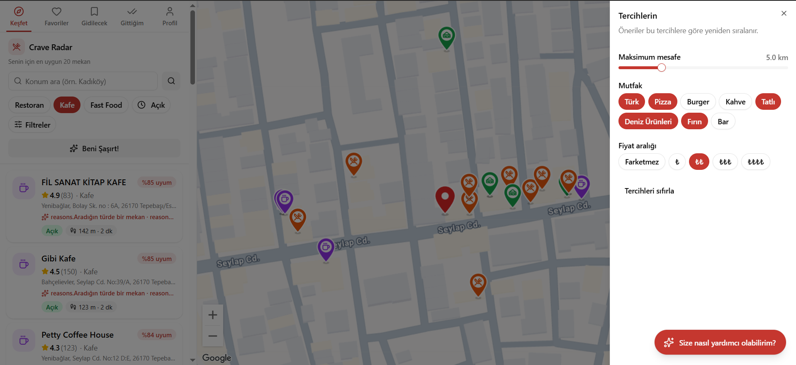
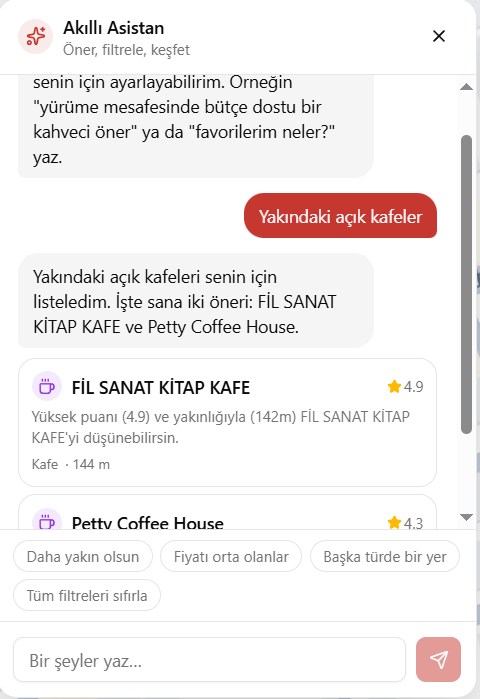
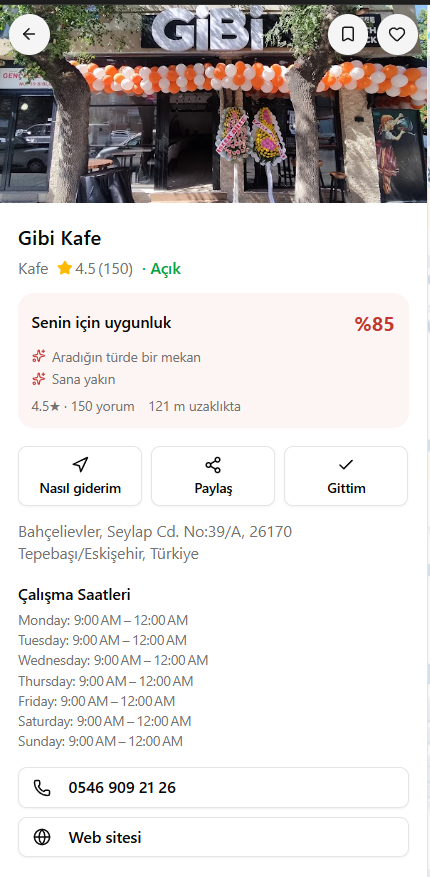

# Crave Radar — Smart Restaurant Finder

A full-stack web app that detects your location, shows nearby restaurants, cafés and
food spots on an interactive map, and **ranks them with a personalized scoring engine**.
It also ships an **AI assistant** that turns natural language ("a budget-friendly coffee
shop within walking distance") into structured filters and concrete recommendations.

[](https://github.com/barisyesil/smart-restaurant-finder/actions/workflows/ci.yml)

**Live demo**
- Frontend (Vercel): https://smart-restaurant-finder-neon.vercel.app
- API (Render): https://smart-restaurant-api-vej4.onrender.com — interactive docs at [`/docs`](https://smart-restaurant-api-vej4.onrender.com/docs)

> The backend runs on Render's free tier, so the first request after idle may take
> ~30 s to wake up (cold start).

## Screenshots

> _Replace these with your own captures (put images under `docs/`)._

| Discover & map | AI assistant | Place detail |
| --- | --- | --- |
|  |  |  |

## Features

- 📍 **Location-aware discovery** — browser geolocation or manual search (Nominatim).
- 🗺️ **Clean Google Map** — custom SVG markers, distinct user pin, POIs/labels hidden.
- 🧠 **Weighted scoring engine** — ranks every candidate 0–100 with explainable reasons.
- 🤖 **AI assistant (Gemini)** — natural language → filters, location and place recommendations.
- ❤️ **Personal lists** — favorites, wishlist, visited; synced to your account on login.
- 🔐 **Auth** — custom JWT + bcrypt; guest data migrates to the server after sign-in.
- 🌐 **i18n** — full Turkish/English UI, including the assistant's replies.
- 🌗 **Dark / light theme**, responsive split-screen (desktop sidebar / mobile bottom-sheet).

## Tech stack

| Layer | Technologies |
| --- | --- |
| Frontend | React, Vite, TypeScript, Tailwind v4, shadcn/ui, Zustand, TanStack Query, `@vis.gl/react-google-maps` |
| Backend | Python, FastAPI, SQLAlchemy, Pydantic |
| Data / AI | Google Places API (New), Google Gemini, Nominatim (geocoding) |
| Auth / DB | PyJWT + bcrypt; SQLite (local) / Neon Postgres (prod) |
| Infra | GitHub Actions (CI), Vercel (frontend), Render (backend), Neon (database) |

## Architecture & engineering decisions

The interesting parts of this project are the *decisions*, not just the features.

### 1. Weighted scoring engine (`backend/app/services/scoring.py`)
Each candidate gets a 0–100 score from a weighted blend:
- **Rating 30% — Bayesian average**, `W = (R·v + C·m) / (v + m)` with `m = 50` and `C` = the
  candidate set's mean rating. *Why:* a raw rating lets a 5.0-with-3-reviews place beat a
  4.6-with-2000-reviews place. The Bayesian prior pulls low-volume ratings toward the mean,
  so confidence (review count) is rewarded.
- **Category/cuisine 30%** — no preference → 60, exact match → 100, mismatch → 20.
- **Distance 25% — exponential decay** with a ~450 m half-life. *Why:* walkability drops off
  non-linearly; a smooth decay models "closer is meaningfully better" better than a hard cutoff.
- **Price 15%**, plus a **content-based favorite-similarity bonus** (max 6) and a **closed
  penalty** (×0.3). Each place surfaces qualitative "why recommended" reasons; exact numbers
  live in the detail card.

### 2. Hybrid AI assistant (`backend/app/services/gemini.py`)
The assistant does **not** free-text its way around the app. Instead:
- Gemini is constrained to a **strict JSON schema** (structured output), returning `actions`
  (filter/location changes), `recommendations` (place ids + reasons) and a localized `reply`.
- A deterministic **`_sanitize` layer** validates everything: cuisine/category values are
  snapped to the real enums, numeric ranges are clamped, and recommended `place_id`s are
  **whitelisted against the actual context** — so the model literally cannot hallucinate a
  place onto the map.
- **Hybrid intelligence:** the scoring engine decides *which* places are good candidates; the
  LLM decides *which of those* matches the user's intent and *why*. The deterministic engine
  is never overridden by the model.
- **Resilience:** on transient errors (429/500/503) it automatically falls back to a lighter
  model; replies and suggestions follow the UI `locale`.

### 3. Map rendering trade-off
Google's `AdvancedMarker` requires a `mapId`, but a `mapId` disables inline `styles` — and we
need inline styles to hide POIs/labels for a clean map. So we deliberately use the **legacy
`Marker` + data-URI SVG icons** (`lucide-static`) to keep both the clean style *and* custom
markers.

### 4. Other decisions
- **Auth:** stateless JWT (PyJWT) + bcrypt; guest lists in localStorage are synced to the
  server on login.
- **Database:** `postgresql://` URLs are auto-rewritten to the `psycopg` driver; tables are
  created on startup (`create_all`) — no migration tool needed for this scope.
- **CORS:** an origin **regex** (`https://.*\.vercel\.app`) accepts both production and Vercel
  preview deployments, and origins are normalized (trailing slashes stripped).
- **CI:** tests are fully mocked, so the pipeline needs no API keys or network.

## Project structure

```
smart-restaurant-finder/
├── backend/            # FastAPI app
│   ├── app/
│   │   ├── api/        # routes: auth, users, places, chat
│   │   ├── services/   # google_places, scoring, gemini
│   │   ├── core/       # config, security
│   │   ├── models/     # SQLAlchemy models
│   │   └── schemas/    # Pydantic schemas
│   └── tests/          # pytest (mocked)
├── frontend/           # React + Vite
│   └── src/
│       ├── features/   # map, places, chat, auth, preferences, saved, profile
│       ├── store/      # Zustand stores
│       ├── hooks/      # data + chat hooks
│       └── i18n/       # TR/EN translations
├── render.yaml         # Render blueprint (backend)
└── .github/workflows/  # CI pipeline
```

## Local setup

### Prerequisites
- Python 3.12, Node.js 24 (npm 11)
- A Google Maps/Places API key, and a free [Gemini API key](https://aistudio.google.com/apikey)

### Backend
```bash
cd backend
python -m venv .venv
.venv\Scripts\activate            # Windows  (source .venv/bin/activate on macOS/Linux)
pip install -r requirements-dev.txt
copy .env.example .env            # then fill in the keys
uvicorn app.main:app --reload     # → http://localhost:8000  (docs at /docs)
```

Key environment variables (`backend/.env`):

| Variable | Purpose |
| --- | --- |
| `GOOGLE_MAPS_API_KEY` | Google Places (New) server key |
| `GEMINI_API_KEY` | Gemini assistant (optional — `/chat` returns 503 if unset) |
| `JWT_SECRET` | ≥ 32-char secret for signing tokens |
| `DATABASE_URL` | empty = local SQLite; Neon Postgres URL in prod |
| `CORS_ORIGINS` | comma-separated allowed origins |

### Frontend
```bash
cd frontend
npm install
copy .env.example .env            # set VITE_API_BASE_URL and VITE_GOOGLE_MAPS_API_KEY
npm run dev                       # → http://localhost:5173
```

## Tests, lint & CI

```bash
# backend
cd backend && ruff check . && pytest -q
# frontend
cd frontend && npm run lint && npm run build   # eslint + tsc + vite
```

Every push and PR runs both suites in parallel via [GitHub Actions](.github/workflows/ci.yml).

## Deployment

| Component | Platform | Notes |
| --- | --- | --- |
| Frontend | **Vercel** | Root `frontend/`, framework auto-detected (Vite) |
| Backend | **Render** | `render.yaml` blueprint; `JWT_SECRET` auto-generated, other secrets set in dashboard |
| Database | **Neon** | Serverless Postgres; connection string in Render's `DATABASE_URL` |

After deploying, set the backend's `CORS_ORIGINS` to the Vercel URL (or rely on the
built-in `*.vercel.app` regex) and add the Vercel domain to the Google Maps key's HTTP
referrer restrictions.

## License

Built as a technical case study for an internship interview.
